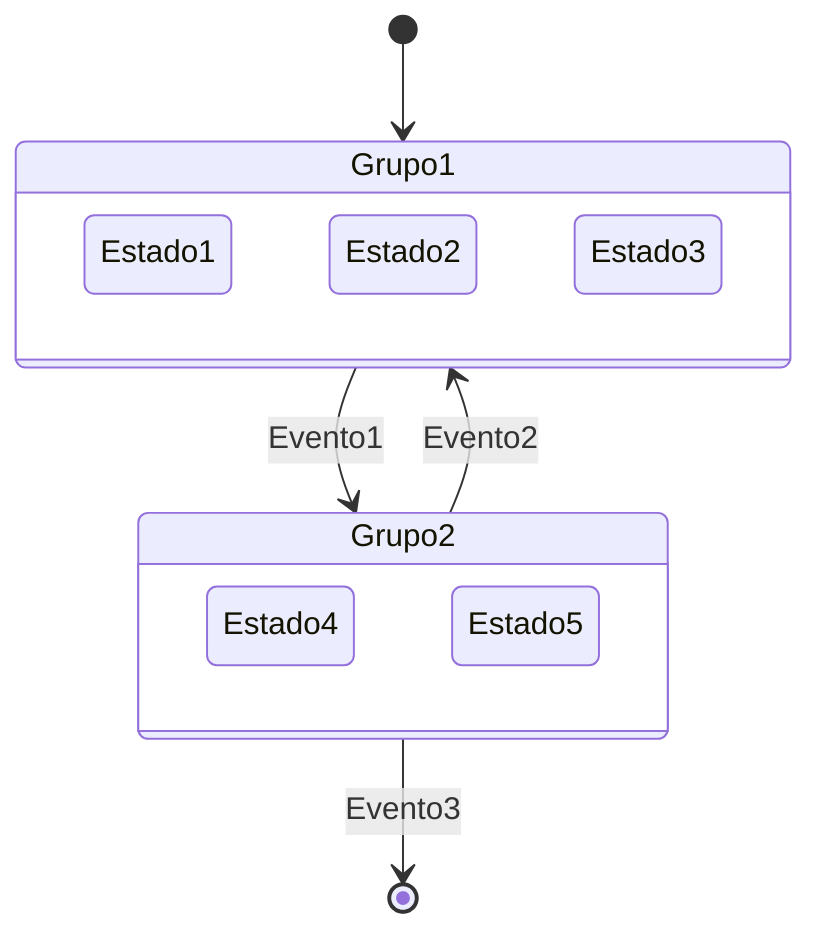

# mermaid-demo

```mermaid
stateDiagram
    [*] --> Grupo1

    state Grupo1 {
        Estado1
        Estado2
        Estado3
    }

    Grupo1 --> Grupo2 : Evento1
    Grupo2 --> Grupo1 : Evento2

    state Grupo2 {
        Estado4
        Estado5
    }

    Grupo2 --> [*] : Evento3
```
